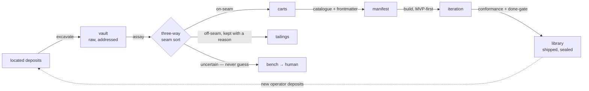
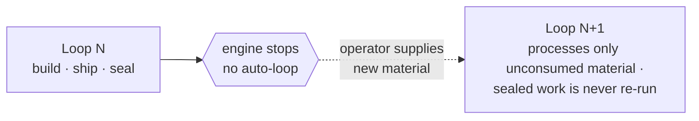
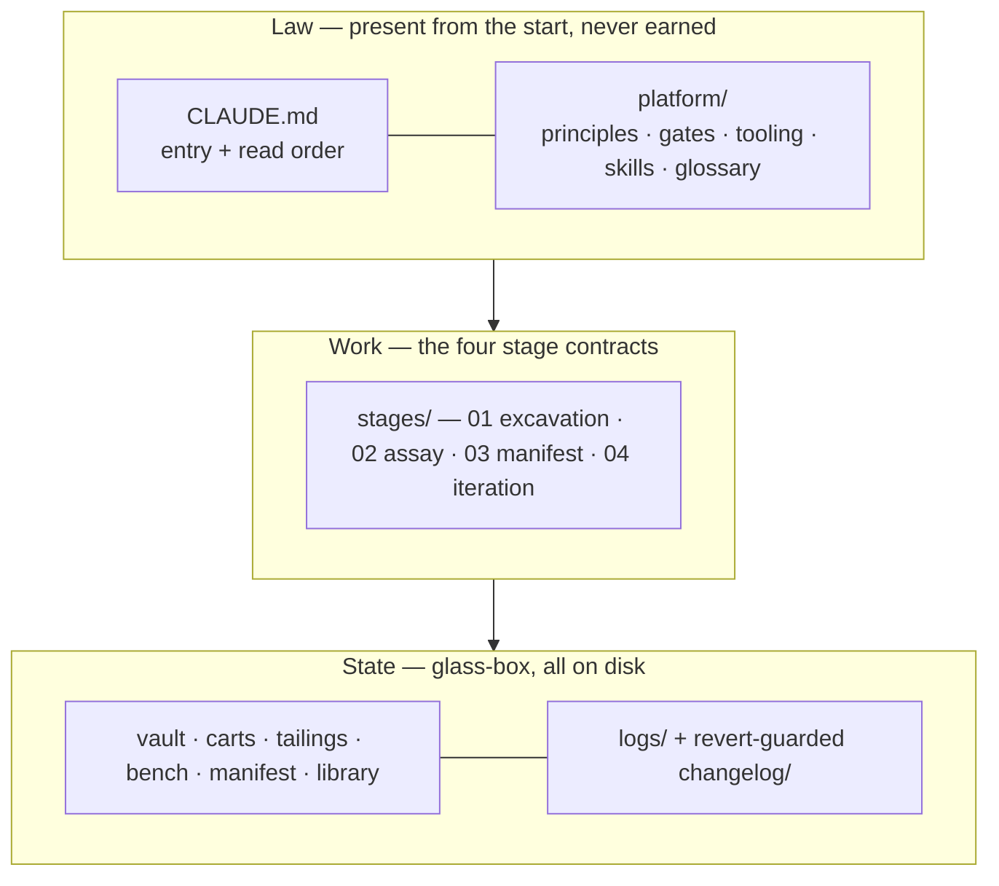

# M2W — Manifest to Workspace

**A deferral-governed pipeline that turns raw, located material into finished deliverables — and compiles its orchestration into structure rather than improvising it in prompts.**

M2W is a domain-agnostic engine for autonomous, multi-stage work. It takes a *manifest* (catalogued,
typed material) and produces a *workspace* (a built deliverable), running stage to stage without a
human steering it and escalating only the decisions it genuinely cannot make. The question it sets out
to answer is not "how do we make an agent do more," but "how do we make an autonomous pipeline that
never contaminates its own context, can always be trusted to stop and resume, and can explain every
decision it made."

This repository *is* the engine. A **pilot** (under `pilots/`) supplies a concrete domain; the core
never names one. Delete the pilots and the engine still stands.

---

## The problem

Autonomous agent systems tend to fail in three quiet ways:

- **Context contaminates.** Work loaded speculatively — material that turns out irrelevant, judgments
  made before they were needed — pollutes the reasoning that follows.
- **Orchestration lives in prompts.** Which tool runs when is re-described every session, so behaviour
  drifts and is never reproducible or auditable.
- **Uncertainty is resolved by guessing.** A system with only *pass* and *fail* has no honest way to
  say "I don't know," so it commits to a call it should not.

M2W is a single, disciplined response to all three.

## The thesis: deferral as a contamination defense

The governing discipline is **deferral** — withhold every evaluation, execution, and judgment until the
moment it is actually required. A stage runs because the prior stage produced something that *requests*
it, never because the stage exists. Nothing is loaded into context speculatively; material sits
addressed on disk until it is pulled.

This is not a delay tactic. It is the contamination defense: a context that admits only what is needed
cannot be polluted by work that was never needed. It is why the pipeline can stop cleanly at any point,
why a bad input dies cheap before triggering expensive downstream work, and why the cost of a mistake
is pushed to the front of the line, where it is cheapest to absorb.

---

## The pipeline

*The dashed return edge is the loop boundary: re-entry is operator-triggered, never an auto-loop.
Off-seam material is tailed (kept with a reason), never deleted; uncertain material benches rather
than committing to a guess.*

Each arrow is a **deferral point** — a checkpoint that asks not "is this good?" but "is the context
clean enough to commit the next step, and does the output conform to its shape?" Quality is never
judged at a gate; it lives in the design schema the deliverable is cut against.

The hard problem here is not navigation. It is deciding what material is worth processing — and
deferring that decision until the material is in hand. That is an **assay** problem, and a real assay is
intrinsically three-way: on-seam material is *carted*, off-seam material is *tailed* (kept, with a
reason, never deleted), and uncertain material is *benched* — escalated to a human. The bench is what
lets the pipeline run autonomously on the settled cases while never committing to an uncertain one.
"I stopped because this was ambiguous" is a success; a plausible guess is a failure, even when it
happens to be right.

---

## What is distinctive

**1 — Orchestration is compiled into structure, not improvised in prompts.**
Most agent orchestration is per-session prompt engineering. M2W encodes the schedule in files a cold
agent reads and executes deterministically: stage contracts declare what each stage produces, the gates
declare when work may commit, and a gate→play map declares which tool fires at which point, on which
model tier. The map is wiring, not documentation:

| Deferral point | what fires | model tier |
|---|---|---|
| Excavation (vaulting) | headless browser / scrape / codified extractors — mechanical haul, no relevance filtering | light |
| Assay (seam sort) | escalate-to-bench only — no review tool, because the seam is the engine's own judgment | mid |
| Iteration — pre-build | precise-spec authoring always; a full reviewed-plan pass when the deliverable warrants it | top |
| Iteration — conformance | sequential cross-model review against the design schema (no parallel workers) | top |
| Done-gate → ship | ship / package / document / post-deploy watch | top |
| Loop boundary | session memory + recall — continuity through files, never an auto-loop | light–mid |

The map is the universal default; a domain instantiation wakes whatever additional tooling it warrants.
Anything parallel or multi-agent by nature is rejected by law.

**2 — Progress is marked by production, not by numbering.**
A run spans many sessions. After a deliverable ships and seals, the engine *stops* — it does not
auto-loop. A new loop begins only when an operator supplies new material, and the engine already knows
what is finished because every piece carries its lifecycle state on disk (consumed / sealed). There is
no run counter: the boundary between loops is simply the frontier of what has been produced. Stop any
time; resume any time; the filesystem is the cursor.

**3 — One agent, many model tiers.**
Execution is single-agent and depth-first by law — no parallelism, no coordination overhead, no large
context loaded at once. But single-agent is not single-model: the one agent switches its own model tier
to match the cognitive demand of each stage — a light, fast model to fetch and catalogue, the strongest
model where judgment lives. The switch is self-directed and deterministic (the tier is declared per
stage), and bounded by a hard rule: a heavier model never earns the right to *resolve* what a gate
defers. Ambiguity at the assay benches on any tier.

---

## How it stays correct

The engineering discipline is as much the artifact as the pipeline:

- **Glass-box.** All state is the filesystem. There is no hidden state; anything true about the
  pipeline is a file on disk, inspectable and gradeable.
- **Canonical sources.** Each concept has exactly one authoritative home; everything else points to it
  rather than restating it. Duplicated detail is treated as a defect — the copy that drifts is where
  bugs hide.
- **A revert-guarded changelog.** Every change to the engine is recorded with its design intent, how it
  was validated, and what breaks if it is undone, so a future session cannot silently revert a tested
  fix.
- **Adversarial cross-model validation.** The engine's major design decisions were each reviewed by a
  second, independent model acting as an adversarial critic, with the findings applied before the
  change was accepted. The assembled system passed a holistic pre-ship review.

---

## Design principles (the non-negotiables)

- **Defer, do not commit.** Withhold evaluation and execution until needed; deferral is the
  contamination defense.
- **You do not think; you execute.** Judgment lives in the files. When uncertain, bench it or log it
  and stop — never guess.
- **Earned, not given.** The repository starts empty except its law; everything else earns its place by
  clearing a deferral point.
- **Glass-box.** State is the filesystem.
- **Single-agent (not single-model).** One reasoning path, the right model tier for each stage.
- **Gates check conformance, never quality.** Quality lives in the shape of the design schema.

---

## Scope and status

M2W is a **standing engine** — run-ready and domain-agnostic. The core carries the law (`CLAUDE.md`,
`platform/`), the four stage contracts (`stages/`), the holding folders, and the logs. A domain is
supplied as a pilot under `pilots/` by copying the template and filling its extension points: the seam
(what belongs to the domain), the deposits (where raw material comes from), the design schema, and the
build workflow. The core never references a pilot; a pilot may reference the core.

It is deliberately *not* a finished product or a one-click tool. It is the frame — the structure that
makes autonomous, auditable, resumable work possible — with the material and the domain tooling supplied
per instantiation. Start at `CLAUDE.md` for the canonical read order.

*Three layers, one rule: the law is read first and never edited mid-run; the work is the stage
contracts; the state is entirely on disk, inspectable and gradeable. Nothing is hidden in the agent's
head.*

---

## Lineage

M2W implements, natively, the methodology of **ICM (Interpreted Context Methodology)** — five-layer
routing, stage contracts, one-way references, canonical sources, glass-box observability — and adds the
mining front-end (excavation → assay → manifest) that ICM assumes you already have. It borrows the
principles, never the engine. An earlier name for the system was *ECA — Earned Contract Architecture*;
the rename reflects a shift in emphasis, from "work proving itself at every gate" to "deferred
commitment that avoids contamination" — the same mechanics, a corrected centre of gravity.
